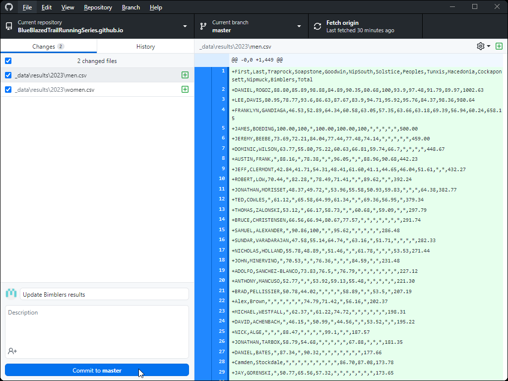

# Updating results in the Blue Blazed Trail Running Series website

The Blue Blazed Trail Running Series website uses CSV files for results. Simply replacing the existing CSV files will cause the new results to be updated. Any properly formatted CSV file is acceptable for uploading. The file names must be 'women.csv' and 'men.csv'.

## Steps to update the results:

First, open GitHub Desktop. Ensure that you're in the BlueBlazedTrailRunningSeries.github.io repository. Click the 'Fetch origin' button in the toolbar at the top of the application to check for project updates, to ensure that you're on the latest version of the project.

Next, copy the updated result files 'women.csv' and 'men.csv' into the results directory, for example _data/results/2023 

You'll be overwriting the exising files.

After the files are copied, return to GitHub Desktop. It will show that there are changes to the two CSV files. Enter a description of the update (Example: "Update Bimblers results"). Then, click the 'Commit to master' button located at the bottom of the application. This commits the changes to your local source control.

Finally, click the 'Push origin' button in the toolbar at the top of the application, which will push those changes to the BlueBlazedTrailRunningSeries website. The project will compile in the cloud, and within a few minutes the changes will be live.

